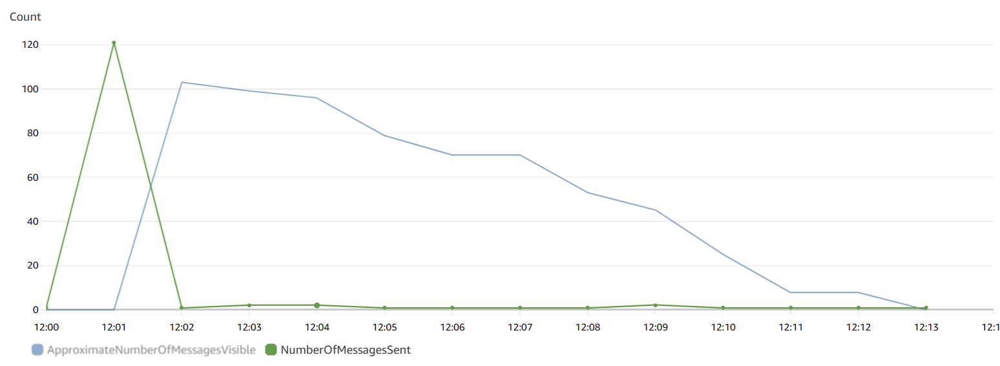
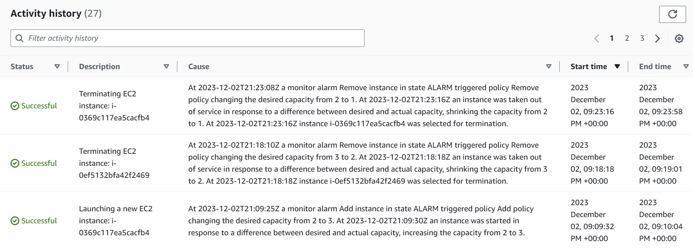

## TASK A - 启动开发实例
- 创建一个 EC2 实例：wordfreq-dev
- 密钥对：wordfreq-dev-key
- 安全组：wordfreq-dev-sg
- 存储卷：30GB GP2
- IAM 实例配置文件（高级细节下）：选择 EMR_EC2_DefaultRole
- Public IP:`ec2-107-22-76-86.compute-1.amazonaws.com`
- username:`ubuntu`

## TASK B - 创建 S3 存储桶
- 创建 S3 存储桶（上传）：`yhb-wordfreq-uploading`
- 创建 S3 存储桶（处理）：`yhb-wordfreq-processing`
- 记录存储桶的 ARN（Amazon 资源名称）：
  - uploading：`arn:aws:s3:::yhb-wordfreq-uploading`
  - processing：`arn:aws:s3:::yhb-wordfreq-processing`

## TASK C - 创建 SQS 队列
- 创建 SQS 队列（用于文件处理作业）：`yhb-wordfreq-jobs`
- 记录队列 URL：`https://sqs.us-east-1.amazonaws.com/666353528894/wordfreq-jobs`
- 创建 SQS 队列（用于文件处理结果）：`yhb-wordfreq-results`
- 记录队列 URL：`https://sqs.us-east-1.amazonaws.com/666353528894/wordfreq-results`

## TASK D - 创建 Amazon SNS 主题
- 创建 Amazon SNS 主题：`yhb-wordfreq-file-copied`
- 记录您的 SNS ARN：`arn:aws:sns:us-east-1:666353528894:wordfreq-file-copied`
- 创建第一个订阅：wordfreq-file-copied
- 创建第二个订阅，对私人电子邮件发送：wordfreq-file-copied

## TASK E - 从存储桶配置文件复制通知到 SNS
- 在s3控制台选择processing存储桶，在properties中创建event notification
- destination选择SNS topic，选择yhb-wordfreq-file-copied

## TASK F - 连接ssh客户端并安装go
使用ssh连接到ec2实例，安装并配置go的环境

## TASK G - 将应用代码压缩包复制到 S3 存储桶 
- 上传`lsde-wordfreq-app.zip`到存储桶
- 该文件的s3 uri：`s3://yhb-wordfreq-uploading/lsde-wordfreq-app.zip`
- 在finalshel运行以下命令：
  - `aws s3 ls`:列出存储桶
  - `aws s3 cp s3://yhb-wordfreq-uploading/lsde-wordfreq-app.zip .`:复制文件到当前目录
  - `ls`:查看当前目录，应该有`lsde-wordfreq-app.zip`和`go1.20.1.linux-amd64.tar.gz`两个文件
  
## TASK H - 