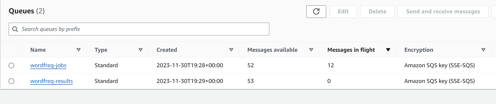
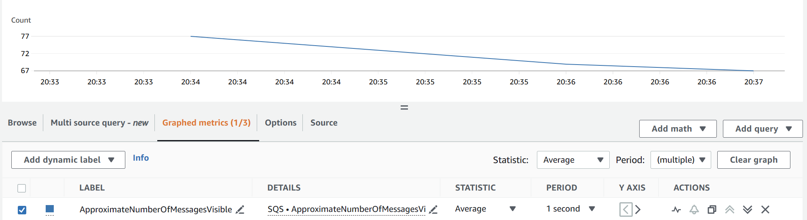
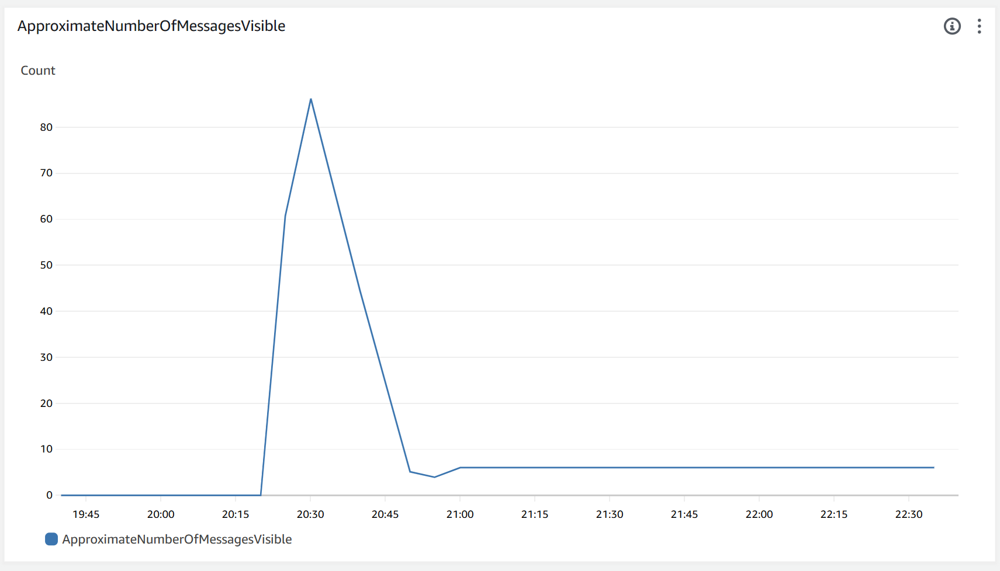
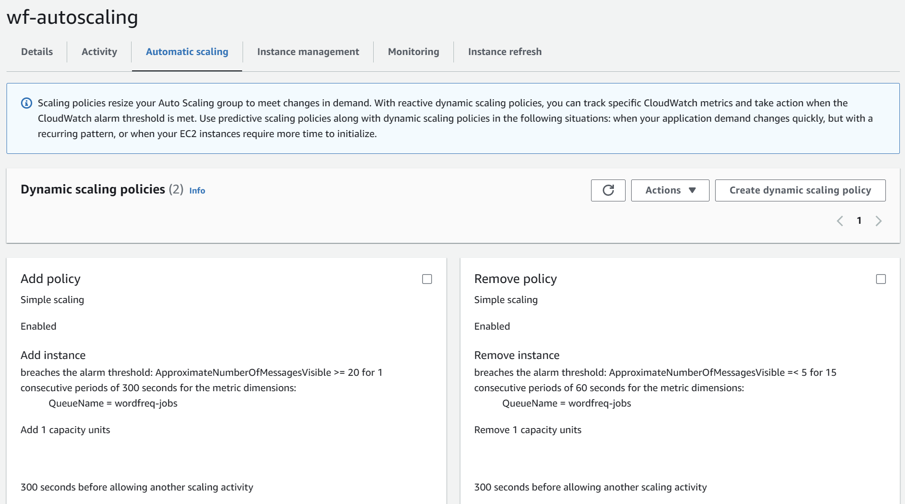

# Auto Scaling Architecture
## 1. 总览

1. **选择合适的性能指标：**
   - 确定哪些性能指标（如 SQS 队列长度、处理时间等）最适合触发扩展规则。注意，“平均 CPU 利用率”可能不是此应用程序的最佳选择。

2. **配置自动扩展规则：**
   - 当超过最大性能指标阈值时，启动一个相同的工作实例。
   - 当低于最小性能指标阈值时，终止最近启动的工作实例。
   - 确保始终至少有一个工作实例可用。

3. **避免频繁扩展：**
   - 设定合理的冷却时间和阈值，以避免每隔几分钟就增加新实例。

## 2. 选择性能指标
对于 WordFreq 程序，考虑到它是基于处理 AWS SQS 队列中的消息，以下指标可能最适合用于自动扩展：

1. **SQS 队列长度：**
队列中消息的数量是一个重要指标，它直接反映了待处理任务的积压情况。如果队列中的消息数量超过某个阈值，表明需要更多的工作实例来处理这些任务。

2. **消息处理时间：** 如果能够监控到消息从进入队列到被处理的时间长度，这个指标也可以用来触发扩展。处理时间的增长通常意味着现有实例无法及时处理消息。

3. **ApproximateNumberOfMessagesVisible**。
这个指标表示在 SQS 队列中当前可见的消息数量，也就是说，这些消息目前等待被处理而还未被任何消费者接收

这些指标都能反映出应用程序当前是否需要更多的资源来处理负载。在 AWS CloudWatch 中，您可以设置基于这些指标的警报，以触发自动扩展操作。在设置这些指标时，请考虑到程序的特定行为和需求，以确保自动扩展可以有效且高效地响应负载变化。

## 3. create a new Launch Template
使用ami模板中的backup3创建一个新的Launch Template，命名为wordfreq-template，
用于使用Auto Scaling Group时创建新的EC2实例。

## 4. Estimate the number of instances
为了估计最大容量 (Max Capacity)，我们需要了解以下信息：

1. **消息处理速度**：每个工作实例平均每秒或每分钟可以处理多少消息。
2. **高峰期消息流入率**：在应用程序负载最高时，预计每秒或每分钟会有多少新消息进入队列。
3. **实例启动时间**：从启动新的 EC2 实例到实例开始处理消息所需的时间。
4. **应用程序的行为**：在高负载时，是否有任何性能下降，以及工作实例处理速度是否会因此变化。

通过这些信息，您可以计算在高峰期需要多少工作实例来处理消息，
确保消息队列不会变得过于拥挤，同时也可以处理突然增加的负载。
如果有必要，您可以进行负载测试，模拟高峰期的情况，以获得更准确的指标。
根据这些指标，您可以设置一个合理的最大容量，
以确保应用程序能够处理高峰时期的流量，
同时也符合您不想要每两分钟就添加新实例的要求。

- wordfreq-jobs：这个队列有52条消息可用（Messages available），这意味着有52条消息等待被处理。此外，有12条消息处于飞行状态（Messages in flight），这意味着这些消息已经被某个消费者接收但还没有被删除或处理完成。
- wordfreq-results：这个队列有53条消息可用，没有消息处于飞行状态。
- “消息可用”指的是队列中等待被消费者接收的消息数量。这些消息尚未被任何消费者接收。
- “消息在飞行中”是指那些已经被消费者接收，但尚未被删除的消息。在消息处理完毕之后，消费者需要从队列中删除这些消息，以防止它们被再次处理。如果消费者在处理消息后没有成功删除消息，该消息会在“可见性超时”期满后再次变为可用状态。

可以看到，使用approximateNumberOfMessagesVisible作为指标，
在三分钟内该指标数量下降10左右，说明每分钟可以处理3-4个消息。（此时仅有一个EC2实例）

如上图是CloudWatch创建的对于approximateNumberOfMessagesVisible的监控图，
可以看到大概20mins内一个ec2实例处理了80个消息左右，同样推断出每分钟可以处理3-4个消息。

可以以此为基准，设计自动扩展的规则。
为了为WordFreq应用程序设置自动扩展的阈值，我们需要根据实例处理消息的能力和消息到达的速度来进行计算。这里是一个设计阈值的基本方法：

1. **计算单个实例的处理能力：**
   - 假设平均每条消息处理时间为15秒（在10-20秒之间的平均值）。
     - 可以由上面metric的图看到，每分钟可以处理3-4个消息
   - 因此，每个实例每分钟可以处理的消息数为 60 / 15 = 4。

2. **估算阈值：**
   - 如果队列中的消息数量超过了一个实例在一定时间内（例如5分钟）可以处理的数量，应该扩展新实例。5分钟内一个实例可以处理的消息为 5 * 4 = 20。
   - 因此，如果`ApproximateNumberOfMessagesVisible`超过20，可以考虑扩展一个新实例。
   - 对于缩减规模，如果`ApproximateNumberOfMessagesVisible`持续低于5（考虑到冷却时间和处理波动），可以考虑移除一个实例。

这些阈值需要根据实际运行情况进行调整。建议在实际工作负载下进行测试，并观察实例的扩展和缩减对队列长度的影响，以便进行适当的微调。

## 4. 创建Auto Scaling Group
1. **创建Auto Scaling Group：**
   - 在 EC2 控制台中，选择“Auto Scaling Groups”。
   - 点击“Create Auto Scaling Group”。
   - 选择刚刚创建的 Launch Template。
   - 选择no load balancer。
   - additional settings中，选择“Enable group metrics collection”。使得CloudWatch可以收集组内实例的指标。
   - 设置desired capacity为1，min capacity为1，max capacity为2
   - no scaling policies
   - notification选择发送到SNS topic yhb-wordfreq-file-copied

2. **创建Auto Scaling Group的Scaling Policies：**
- 选择创建dynamic scaling policy
- 选择simple scaling
- 选择使用cloudwatch alarm
- 首先需要创建一个policy，此时可以在cloudwatch中创建一个alarm，这个alarm根据这个simple scaling policy找到我的auto scaling group，然后根据这个auto scaling group
- 设置alarm的metric为SQS的ApproximateNumberOfMessagesVisible，设置threshold为20，period为5mins，当大于等于20时，触发alarm
- 将该alarm连接到之前的policy，称为add policy，设定触发alarm则add 1 instance
- 同样方法创建sub policy，当alarm小于等于5时，remove 1 instance

#### 关于Auto Scaling Group中不同type的policy：
- **Target Tracking Scaling Policy**：根据指标的变化，自动调整实例数量，使得指标保持在目标值附近。
- **Simple Scaling Policy**：根据指标的变化，自动调整实例数量，使得指标保持在目标值附近。
- **Step Scaling Policy**：根据指标的变化，自动调整实例数量，使得指标保持在目标值附近。但是，与前两种不同的是，Step Scaling Policy可以根据指标的变化，调整实例数量的多少，而不是只能增加或减少一个实例。

其中Simple 和 Step policy可以根据cloudwatch的指定指标得到的alarm进行调整，而Target policy则是根据指定的target value（仅四五个）进行调整。

