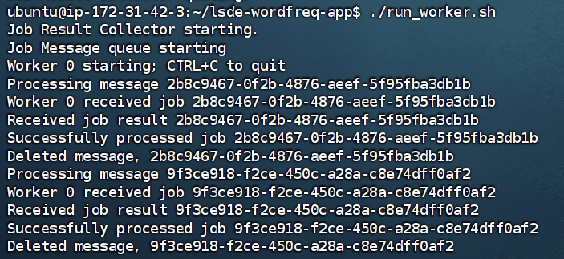
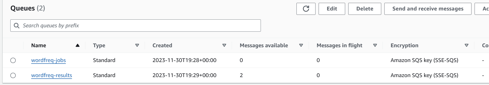
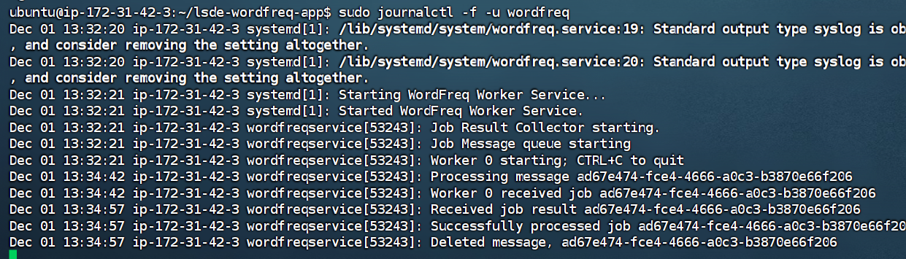
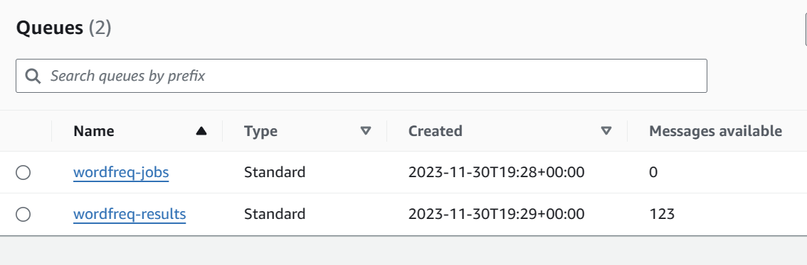
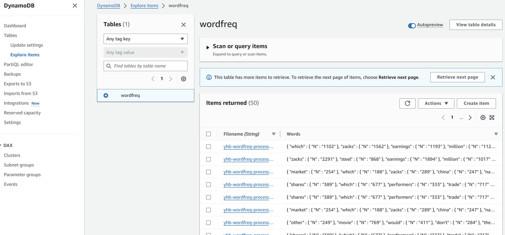

# Wordfreq程序基本配置
## TASK A - 启动开发实例
- 创建一个 EC2 实例：wordfreq-dev
- 密钥对：wordfreq-dev-key
- 安全组：wordfreq-dev-sg
- 存储卷：30GB GP2
- IAM 实例配置文件（高级细节下）：选择 EMR_EC2_DefaultRole
- username:`ubuntu`
- 重启 EC2 实例后，免费的公共 IP 会更改，因此如果您仅通过 IP 地址访问 SSH，则需要复制新的 IP。


## TASK B - 创建 S3 存储桶
- 创建 S3 存储桶（上传）：`yhb-wordfreq-uploading`
- 创建 S3 存储桶（处理）：`yhb-wordfreq-processing`
- 记录存储桶的 ARN（Amazon 资源名称）：
  - uploading：`arn:aws:s3:::yhb-wordfreq-uploading`
  - processing：`arn:aws:s3:::yhb-wordfreq-processing`


## TASK C - 创建 SQS 队列
- 创建 SQS 队列（用于文件处理作业）：`yhb-wordfreq-jobs`
- 记录队列 URL：`https://sqs.us-east-1.amazonaws.com/666353528894/wordfreq-jobs`
- 创建 SQS 队列（用于文件处理结果）：`yhb-wordfreq-results`
- 记录队列 URL：`https://sqs.us-east-1.amazonaws.com/666353528894/wordfreq-results`


## TASK D - 创建 Amazon SNS 主题
- 创建 Amazon SNS 主题：`yhb-wordfreq-file-copied`
- 记录您的 SNS ARN：`arn:aws:sns:us-east-1:666353528894:wordfreq-file-copied`
- 创建第一个订阅：wordfreq-file-copied
- 创建第二个订阅，对私人电子邮件发送：wordfreq-file-copied


## TASK E - 从存储桶配置文件复制通知到 SNS
- 在s3控制台选择processing存储桶，在properties中创建event notification
- destination选择SNS topic，选择yhb-wordfreq-file-copied

### 关于SNS和SQS以及订阅操作的理解

- **SNS**：一个发布/订阅消息通知服务，可以向多个订阅者发送同一消息。
- **SQS**：一个消息队列服务，允许应用程序通过标准的消息队列或FIFO队列异步处理消息。


#### 任务C - 创建SQS队列
- **创建两个SQS队列**：用于管理文件处理作业。一个队列用于存放文件处理作业（"wordfreq-jobs"），另一个用于存放处理结果("wordfreq-results")。
- **设置队列类型为标准**：这意味着队列提供最大吞吐量，但不保证消息顺序。
- **记录队列URL**：用于后续配置和队列访问。

#### 任务D - 创建Amazon SNS主题
- **创建SNS主题**：用于广播文件复制事件的通知。
- **设置主题类型为标准**：提供即时、多订阅者的消息传递。
- **创建订阅**：
  - 第一个订阅将SNS主题与SQS队列（"wordfreq-jobs"）关联，用于接收文件处理作业的通知。
  - 第二个订阅设置为电子邮件协议，用于向指定的电子邮件地址发送通知。

#### 任务E - 从存储桶配置文件复制通知到SNS
- **配置S3事件通知**：当S3存储桶中发生文件创建事件（如文件上传）时，触发通知。
- **设置事件通知目的地为SNS主题**：这意味着每当文件被上传到S3存储桶时，都会发送一条消息到"SNS主题"。
- **事件通知结果**：文件上传至S3后，相关的通知会被发送至SNS主题，然后由订阅了该主题的SQS队列接收，触发相应的处理流程。

#### 总结
当上传一个文件到s3 processing桶后，会触发下列行为：
（由于仅对processing桶创建了 event notification并连接到sns topic，所以仅对该桶发生）

1. **文件上传到 S3**：当您将文件上传到 S3 processing存储桶时，这是整个流程的起始点。

2. **S3 触发通知**：S3 存储桶配置了一个事件通知，当有文件被上传（或其他定义的事件发生）时，S3 会触发这个通知。

3. **发送到 SNS 主题**：S3 的这个通知被发送到一个预先定义的SNS主题。这个主题充当通知的集中分发点。

4. **SNS 主题向订阅者发送通知**：SNS 主题有多个订阅者。每当向主题发送消息时，它会将这个消息推送给所有订阅者。在您的案例中，有两个订阅者：
   
   - **Subscribe1 与 SQS 队列1（Jobs）关联**：第一个订阅者是一个SQS队列。当 SNS 主题接收到通知时，它会将这个消息发送到与之关联的 SQS 队列（wordfreq-jobs）中。这个队列通常用于进一步处理或任务分配。
   
   - **Subscribe2 与电子邮件关联**：第二个订阅者是一个电子邮件地址。这意味着当 SNS 主题接收到通知时，它会将消息作为电子邮件内容发送到指定的电子邮件地址。这通常用于通知系统管理员或其他相关人员文件上传的情况。

这个过程实现了事件的自动化处理，通过 SNS 和 SQS 的组合，可以高效地管理消息通知和基于这些通知的任务执行。
通过这个流程，您可以实现文件上传到S3后的自动化处理，无需人工干预。这对于需要处理大量文件上传的应用程序非常有用，如数据分析、文件备份系统或内容管理系统。


## TASK F - 连接ssh客户端并安装go
使用ssh连接到ec2实例，安装并配置go的环境
1. **确认成功登录：**
   - 如果您看到类似 'ubuntu@ip-172-XXX-XXX-XXX' 或 ':~ $' 的命令行提示符（可能需要 30 秒才会完全显示），这表明您已成功登录。

2. **更新系统并安装必要工具：**
   - 在 SSH CLI 窗口中运行以下命令来更新系统（可能需要一两分钟）：
     ```
     sudo apt update
     ```
   - 安装 AWS CLI 和 unzip 工具：
     ```
     sudo apt install awscli
     sudo apt install unzip
     ```
7. **安装并配置 Go 语言环境：**
   - 下载 Go 语言包：
     ```
     wget https://go.dev/dl/go1.20.1.linux-amd64.tar.gz
     ```
   - 解压文件并移动到相应目录：
     ```
     sudo tar -C /usr/local -xzf go1.20.1.linux-amd64.tar.gz
     ```
   - 在 `.bash_profile` 中添加 Go 到 `$PATH` 环境变量：
     ```
     vi ~/.bash_profile
     ```
       ```
       export PATH=$PATH:/usr/local/go/bin
       export GOPATH=$HOME/go
       export PATH=$PATH:$GOPATH/bin
       ```
   - 重新加载 profile 并检查 Go 是否安装以及其版本：
     ```
     source ~/.bash_profile
     go version # 正常显示版本则表示安装成功
     ```
     
## TASK G - 将应用代码压缩包复制到 S3 存储桶 
- 上传`lsde-wordfreq-app.zip`到uploading存储桶
- 该文件的s3 uri：`s3://yhb-wordfreq-uploading/lsde-wordfreq-app.zip`
- 在finalshel运行以下命令：
  - `aws s3 ls`:列出存储桶
  - `aws s3 ls bucket-name`:列出指定存储桶中的文件
  - `aws s3 cp s3://yhb-wordfreq-uploading/lsde-wordfreq-app.zip .`:复制文件到当前目录
  - `ls`:查看当前目录，应该有`lsde-wordfreq-app.zip`和`go1.20.1.linux-amd64.tar.gz`两个文件
  
## TASK H - 配置WordFreq应用程序
- 切换到 `lsde-wordfreq-app` 文件夹，并确保所有 shell 脚本具有正确的执行权限：
  ```
  cd lsde-wordfreq-app 
  chmod +x *.sh #给所有shell脚本添加执行权限
  ```
- 运行setup.sh脚本，这将安装 GO 语言运行环境和任何依赖项，同时创建 DynamoDB 的 'wordfreq' 数据库表：
  ```
  ./setup.sh
  ```
- 在另一个浏览器标签页中打开 DynamoDB 控制台，点击 Tables，选择 wordfreq 并点击 View Items，将显示添加到表中的项目（行）。最初，该表是空的。
- 打开并编辑 `run_worker.sh` 脚本：
     - 使用箭头键将光标移到以下行：
     ```
     export WORKER_QUEUE_URL="https://sqs.us-east-1.amazonaws.com/12345678/wordfreq-jobs"
     ```
   - 按 'i' 进入插入模式，然后删除 URL 并粘贴或输入您记录的 sqs-jobs 队列的 URL。
   - 同样编辑以下行，更新 sqs-results 队列的 URL 值：
     ```
     export WORKER_RESULT_QUEUE_URL="https://sqs.us-east-1.amazonaws.com/12345678/wordfreq-results"
     ```
     

## TASK I - 测试WordFreq应用程序
- 运行worker.sh脚本
    ```
     cd ~/lsde-wordfreq-app
     ./run_worker.sh
  # 此时会有一些日志输出，表示worker正在寻找待处理的文件；
  # 当上传文件到processing桶后，worker会自动处理文件
     ```
- 上传文本文件到processing桶，可以看到worker自动处理文件；同时email和sqs-jobs队列也会收到通知


ps：我上传了data文件夹下1，2两个文件，会受到两个message。

## TASK J - 将wordfreq脚本配置为服务
- 仍在lsde-wordfreq-app目录下，运行以下命令：
  ```
  # 该脚本会将wordfreq配置为服务，使其在后台运行
  # 将在启动时自动启动。自动扩展 EC2 worker 实例需要以这种方式配置此服务
  ./configure-service.sh
  ```
- 查看worker服务的运行日志：
```
sudo journalctl -f -u wordfreq
```
- 停止或启动该服务：使用systemctl stop/start wordfreq
- 再次上传文本文件到processing桶，通过jornalctl查看日志，可以看到worker自动处理文件



## TASK K - 文件准备：上传文件到S3 uploading桶
- 将data.zip解压，并将其中120个txt文件上传到S3 uploading桶

## TASK L - 复制文件到S3 processing桶
- 通过S3控制台，将S3 uploading桶中的文件复制到S3 processing桶中
- 或者使用aws cli命令：
  ```
  aws s3 cp s3://yhb-wordfreq-uploading s3://yhb-wordfreq-processing --exclude "*" --include "*.txt" --recursive
  ```

- 此过程结束后应该会收到120个email以及120个sqs-jobs队列的通知
- 注意：在工作进行中时，sqs-jobs和sqs-results都会收到通知，但是当工作结束后，sqs-jobs不会再收到通知，只有sqs-results会收到通知，这是因为worker会自动删除sqs-jobs队列中的消息，但是不会删除sqs-results队列中的消息。




#### 使用run_upload.sh脚本上传文件
- 在lsde-wordfreq-app目录下，运行以下命令：
  ```
  ./run_upload.sh BUCKET_NAME FILE_TO_UPLOAD
  ## eg: 
  ./run_upload.sh yhb-wordfreq-uploading ~/Coursework_LSDE_2324_Data_Science\(3\).pdf 
  ```
#### 在DynamoDB中查看结果


