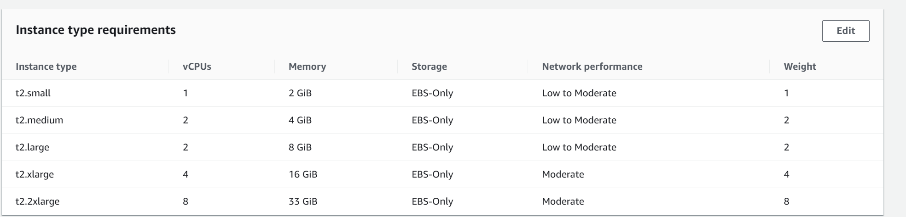

# Issues and Solutions

## 1. Issues and Solutions
### 1.1. 自动扩展行为失败
在我尝试使用不同instance type（混合）创建Auto Scaling Group时，
无法成功进行自动扩展。我设置了最小实例数为1，最大实例数为5，实例类型按权重分为\
t2.micro（权重1）、t2.small（权重2）、t2.medium（权重3）。

但是当我进行负载测试时，发现Auto Scaling Group并没有按照我的预期进行自动扩展。实际上
根本没有自动添加新的实例，而是一直使用一个t2.micro实例进行处理。

### 1.2. 扩展行为没按照预期进行
在我进行一个实验测试不同扩展策略时，我的scaling policy设置如下：

- Remove Policy：
  - Remove 3 capacity units when 15 >= ApproximateNumberOfMessagesVisible > 5
  - Remove 1 capacity units when 5 >= ApproximateNumberOfMessagesVisible > -infinity
- Add Policy：
  - Add 3 capacity units when 20 <= ApproximateNumberOfMessagesVisible < 60
  - Add 1 capacity units when 60 <= ApproximateNumberOfMessagesVisible < +infinity

1. issue1：\
实验过程中我发现由于我的文件是一次性从uploading桶上传到processing桶的，所以在上传过程中队列长度会很短时间内增长到峰值，
导致add policy只会触发add 1 capacity unit的动作，而不会触发add 3 capacity units的动作。

解决方法：修改add policy：
- Add 1 capacity units when 20 <= ApproximateNumberOfMessagesVisible < 60
- Add 3 capacity units when 60 <= ApproximateNumberOfMessagesVisible < +infinity

结果：可以在第一次触发扩展时，一次性增加3个实例，加快处理速度。

2. issue2：\
当完成工作后进行缩减实例时，由于我设置的datapoints to alarm 为 2 out 3min，虽然敏感度较高，但是由于CloudWatch有一定延迟，
还是只会触发remove 1 capacity unit的动作，最大实例5个的情况下，每次只缩减1个，导致缩减速度过慢。

解决方法：修改alarm，将datapoints to alarm改为1 out 1min，这样对指标探测十分敏感，可以在短时间内触发remove 3 capacity units的动作。
增加完成工作后的缩减速度，减少成本。

3. issue3：\
使用mix-instances的auto scaling group进行负载测试时，自动扩展行为只会添加t2.small类型的实例.此时我的实例权重如下：\


解决方法：在混合实例Auto Scaling组中，不同实例类型的权重会影响Auto Scaling选择添加哪种类型的实例。如果t2.small的权重最低，
那么在成本优化的逻辑下，Auto Scaling更倾向于添加成本最低的实例。\
为了使Auto Scaling能够根据负载添加不同类型的实例，您可以这样修改您的扩展策略：

- 对于添加实例（Step Add）：
添加容量单位时，设置具体的容量单位数值，如4或8，这样Auto Scaling有更多选择来决定添加哪种实例类型。
例如：如果您设置“Add 4 capacity units when 20 <= ApproximateNumberOfMessagesVisible < 60”，Auto Scaling可能会选择添加一个t2.xlarge实例或者两个t2.medium实例。
- 对于移除实例（Step Remove）：
移除容量单位时，同样要考虑权重。设置具体的容量单位数值，如4或8。
例如：如果您设置“Remove 4 capacity units when 15 >= ApproximateNumberOfMessagesVisible >= 5”，Auto Scaling可能会移除一个t2.xlarge实例或者两个t2.medium实例。

4. issue4：\
在添加自动扩展策略时，发现报错：
```
/Add policy]' at 'alarmActions' failed to satisfy constraint: Member must have length less than or equal to 5
```
即一个alarm只能连接到5个policy。\
解决方法：删除多余的policy即可


### 2.2. Auto Scaling Group
- 使用不同availability zones和subnet来提高可用性。 **done**
- 实际工作中可能不是直接一次性将文件从uploading桶上传到processing桶，而是分批次不断上传，
此时可能需要根据实际情况继续调整扩展策略，包括设定新的CloudWatch alarm，以及修改scaling policy。以达到
减少由于短暂的数值波动导致的误报的情况，保证自动扩展的可靠性和效率。
- 使用s3 versioning功能，可以在文件上传时自动创建版本，以防止重要文件被覆盖或者误删。