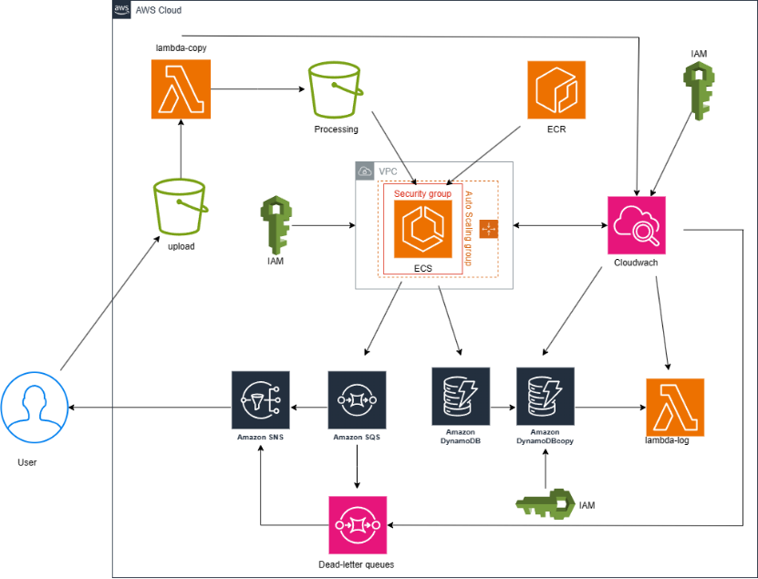
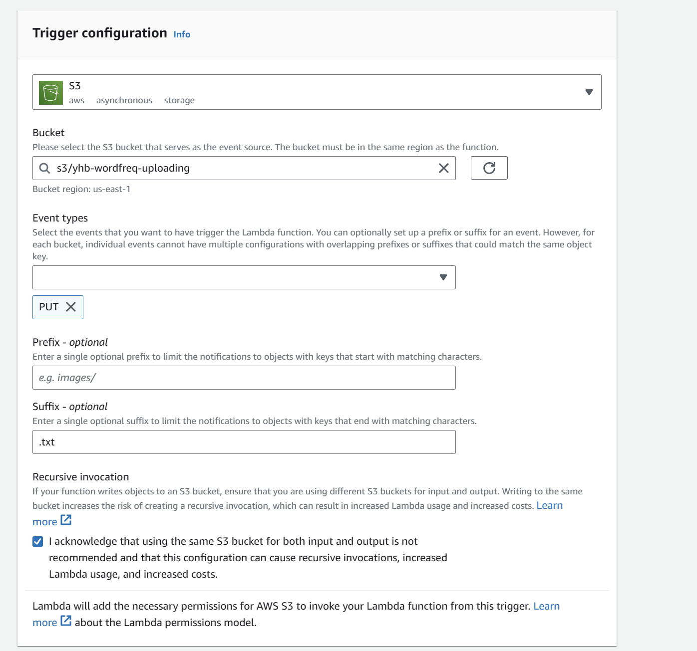
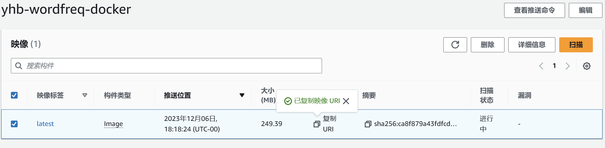
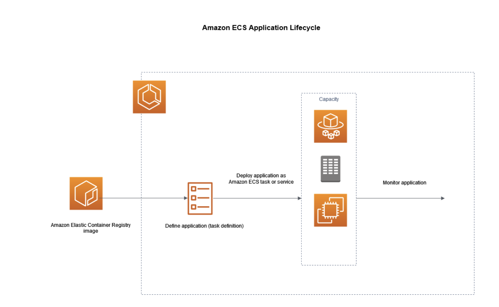
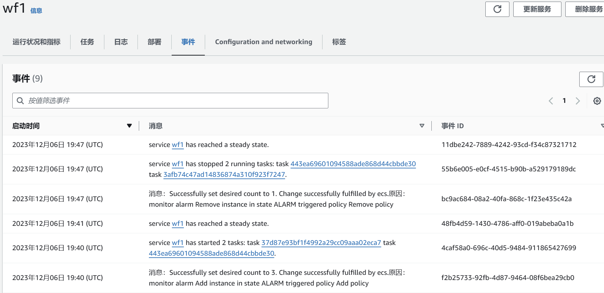
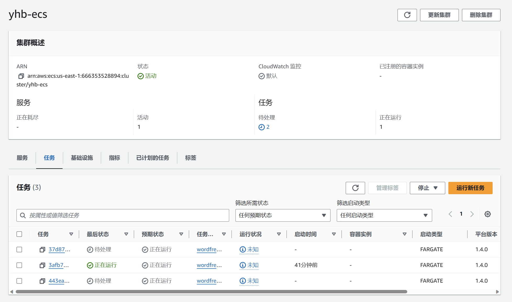

# Optimise the Architecture

架构图如下所示：


这个AWS架构设计是一个典型的无服务器架构，它利用了多个AWS服务来实现高效的数据处理和管理。下面是对其工作原理的分析：

1. **上传触发Lambda**：用户上传文件至S3桶，这个动作触发了一个Lambda函数。Lambda是AWS的无服务器计算服务，可以运行代码来响应事件，如S3的文件上传。

2. **数据复制到工作桶**：Lambda函数自动将数据从上传桶复制到一个工作桶中。这步操作是数据处理流程的准备阶段。

3. **日志存储至CloudWatch**：每次数据处理的运行日志都会被存储在CloudWatch中。CloudWatch提供日志管理和监控服务，有助于跟踪和分析系统运行状况。

4. **ECR和ECS运行应用程序**：数据处理是由存储在ECR（Elastic Container Registry）中的应用程序完成的。这些应用程序在ECS（Elastic Container Service）上运行。ECS提供了容器化应用程序的管理，比EC2轻量且更容易实现自动伸缩和迭代更新。

5. **CloudWatch监控和自动伸缩**：CloudWatch监控ECS服务的状态，并根据需要自动调整容器实例的数量。

6. **处理结果存储和通知**：处理完成后，结果被发送至DynamoDB（一种NoSQL数据库服务）。同时，SQS（Simple Queue Service）接收处理信息，并通过SNS（Simple Notification Service）向用户发送邮件通知。

7. **死信队列和通知**：对于无法处理的数据，系统会将信息发送至一个死信队列，并通过SNS通知用户。

8. **DynamoDB自动备份和监控**：DynamoDB设置了自动定期备份，CloudWatch监控备份状态。当进行备份时，会触发一个Lambda函数，将相关日志发送至CloudWatch。

整体上，这个架构通过整合Lambda, S3, ECS, ECR, DynamoDB, SQS, SNS, 和 CloudWatch，实现了一个高度自动化和可伸缩的数据处理和管理系统。它不仅提高了数据处理的效率，还通过定期备份和监控提高了数据安全性，同时无服务器架构也有助于降低成本。

ECS: Elastic Container Service, 容器服务，用于管理容器化应用程序，比EC2更轻量，更容易实现自动伸缩和迭代更新。
- 例子：比如将一个应用程序打包成一个docker image，然后将这个image上传到ECS，ECS会自动运行这个image。

ECR: Elastic Container Registry, 容器注册表，用于存储容器镜像。
- 使用场景：

## 1. 创建Lambda函数
### 1.1. 创建上传触发Lambda函数
创建一个lambda函数用于处理上传文件的事件，将文件从上传桶复制到工作桶中。
需要一个Role来授予Lambda函数相关权限：
- S3读取权限：允许Lambda从源S3桶读取文件。
- S3写入权限：允许Lambda写入到目标S3桶。
- CloudWatch写入权限：允许Lambda将日志写入CloudWatch。

由于lab并没有足够权限创建新的role，只能使用原本lab的role：LabRole。

创建好函数，将lambda函数体复制到代码编辑器中。

### 1.2. 创建trigger


- 使用s3 uploading bucket作为源，event type选择put，suffix选择`.txt`
- 进行测试，test event为以下json格式：
```json
{
  "Records": [
    {
      "eventVersion": "2.1",
      "eventSource": "aws:s3",
      "awsRegion": "us-east-1",
      "eventTime": "2023-12-05T12:58:00.000Z",
      "eventName": "ObjectCreated:Put",
      "s3": {
        "bucket": {
          "name": "yhb-wordfreq-uploading",
          "ownerIdentity": {
            "principalId": "EXAMPLE"
          },
          "arn": "arn:aws:s3:::yhb-wordfreq-uploading"
        },
        "object": {
          "key": "1.txt",
          "size": 1024,
          "eTag": "0123456789abcdef0123456789abcdef",
          "sequencer": "0A1B2C3D4E5F678901"
        }
      }
    }
  ]
}
```
- 测试成功，当上传一个txt文件到uploading桶时，会触发lambda函数，将文件复制到processing桶中。并且在CloudWatch中可以看到日志。

## 2. 创建ECS服务
### 2.1. 创建docker image
这段代码是一个Dockerfile的内容，用于创建一个Docker容器映像。具体的命令解释如下：

1. `FROM ubuntu:22.04`
   这条命令设置了基础映像为Ubuntu 22.04。这意味着容器将基于Ubuntu 22.04版本构建。

2. `RUN apt-get update`
   更新包索引。这是安装软件前的常规步骤，以确保获取到最新的软件包列表。

3. `RUN apt-get install -y curl unzip`
   安装`curl`和`unzip`工具。`curl`用于传输数据，`unzip`用于解压缩文件。参数`-y`表示在安装过程中对所有提示自动回答“yes”。

4. `RUN curl https://awscli.amazonaws.com/awscli-exe-linux-x86_64.zip -o awscli2.zip && \`
   `unzip awscli2.zip && \`
   `./aws/install --bin-dir /usr/local/bin --install-dir /usr/local/aws-cli --update`
   这条命令完成了三个操作：
   - 使用`curl`下载AWS CLI版本2的zip文件。
   - 使用`unzip`解压下载的zip文件。
   - 运行解压后的安装脚本安装AWS CLI，并指定二进制文件的安装位置和安装目录。参数`--update`表示如果已安装旧版本，将其更新。

5. `RUN mkdir /app`
   创建一个名为`app`的新目录，以存放应用程序文件。

6. `COPY lsde-wordfreq-app.tar.gz /app`
   将本地文件`lsde-wordfreq-app.tar.gz`复制到容器中的`/app`目录。

7. `WORKDIR /app`
   将工作目录更改为`/app`。后续的`RUN`命令将在此目录下执行。

8. `RUN tar -zxvf lsde-wordfreq-app.tar.gz`
   解压`lsde-wordfreq-app.tar.gz`文件。

9. `WORKDIR /app/lsde-wordfreq-app`
   将工作目录更改到解压后的应用程序目录中。

10. `CMD ["sh","run_worker.sh"]`
    设置容器启动时默认执行的命令。在这里，它将执行一个名为`run_worker.sh`的脚本，该脚本需要使用`sh`（shell）来运行。

```bash
FROM ubuntu:22.04

RUN apt-get update

RUN apt-get install -y curl unzip

RUN curl https://awscli.amazonaws.com/awscli-exe-linux-x86_64.zip -o awscli2.zip && \
    unzip awscli2.zip && \
    ./aws/install --bin-dir /usr/local/bin --install-dir /usr/local/aws-cli --update

RUN mkdir /app
COPY lsde-wordfreq-app.tar.gz /app
WORKDIR /app
RUN tar -zxvf lsde-wordfreq-app.tar.gz
WORKDIR /app/lsde-wordfreq-app
CMD ["sh","run_worker.sh"]

```

总结来说，这个Dockerfile的目的是构建一个包含特定应用程序 （`lsde-wordfreq-app`）的Docker容器，
该应用程序似乎是一个与词频有关的服务或工作。
容器将包含必要的工具，如AWS CLI，以便与AWS服务交互。
构建完成后，容器启动时将执行`run_worker.sh`脚本。


### 2.2 在EC2实例上创建Docker镜像


#### 1. 登录到您的 EC2 实例
首先，您需要通过 SSH 登录到您的 EC2 实例。使用如下命令：

```bash
ssh -i /path/to/your-key.pem ec2-user@your-ec2-instance-public-ip
```

请将 `/path/to/your-key.pem` 替换为您的私钥文件路径，`ec2-user` 替换为 EC2 实例的用户名（取决于您的 AMI，例如 Amazon Linux 的默认用户名是 `ec2-user`，Ubuntu 的默认用户名是 `ubuntu`），`your-ec2-instance-public-ip` 替换为 EC2 实例的公有 IP 地址。

#### 2. 安装 Docker（如果尚未安装）
如果您的 EC2 实例上尚未安装 Docker，您可以通过以下命令进行安装：

对于基于 Debian 或 Ubuntu 的系统：

```bash
sudo apt-get update
sudo apt-get install docker.io
```

对于基于 RHEL 或 CentOS 的系统：

```bash
sudo yum update
sudo yum install docker
```

然后，启动 Docker 并设置为开机自启动：

```bash
sudo systemctl start docker
sudo systemctl enable docker
```

#### 3. 创建 Dockerfile
在您的应用程序根目录中创建一个 `Dockerfile`。首先，导航到存放您应用程序的目录：

```bash
cd /path/to/your/app
```

使用文本编辑器创建 `Dockerfile`：

```bash
sudo nano Dockerfile
```

#### 4. 编写 Dockerfile
在 `Dockerfile` 中写入适当的指令来构建您的应用程序镜像。

这只是一个示例，具体内容取决于您的应用程序需求。

#### 5. 保存 Dockerfile
在 nano 编辑器中，使用 `Ctrl+O` 保存文件，然后使用 `Ctrl+X` 退出。

#### 6. 构建 Docker 镜像
在包含 `Dockerfile` 的目录下运行 Docker 构建命令：

```bash
docker build -t wordfreq-docker .
```

#### 7. 测试 Docker 镜像
运行 Docker 容器来测试您的应用程序：

```bash
docker run -p 4000:80 wordfreq-docker
# -p 参数将容器的 80 端口映射到主机的 4000 端口
```
`http://<server-ip>:4000` 浏览器访问该地址，如果能够看到应用程序的输出，说明容器运行成功。
这些步骤将指导您在 EC2 实例上创建和测试 Docker 容器。完成后，您可以将镜像推送到 Amazon ECR 或其他容器注册表。

#### 8. 将 Docker 镜像推送到 Amazon ECR
首先，您需要在 Amazon ECR 中创建一个存储库。
然后根据ecr官方提示的push命令推送镜像：

使用下面命令登录到 Amazon ECR：
```bash
aws ecr get-login-password --region us-east-1 | docker login --username AWS --password-stdin 666353528894.dkr.ecr.us-east-1.amazonaws.com
```
如果出现permission denied，可以尝试将用户添加到docker组：
```bash
sudo usermod -aG docker $USER
```
然后重启ssh客户端，重新连接即可
然后按照官方提升进行推送。如下所示即推送到ECR成功



### 2.3 创建ECS服务

#### 1. 创建ECS集群
完成镜像推送之后，下一步是在AWS ECS（Elastic Container Service）中使用这个镜像来创建和运行容器。这包括创建一个任务定义（task definition）、创建一个服务（service），并可能涉及配置负载均衡和网络设置。以下是详细步骤：

#### 2.创建任务定义，并在ECS集群中创建服务

### 任务（Task）
- **基本单位**：任务是ECS中的一个基本单位，它表示在单个容器或多个容器中运行的一个应用程序实例。任务可以看作是一个容器的运行配置，它告诉ECS如何运行容器，包括使用哪个Docker镜像、容器需要多少CPU和内存资源、环境变量是什么，以及包含哪些端口映射等信息。
- **任务定义（Task Definition）**：每个任务都是根据任务定义来创建的，任务定义是一个模板，它描述了一个或多个容器的属性。

### 服务（Service）
- **长期运行和管理**：服务是一个高级概念，它管理一个或多个相同的任务，并确保指定数量的任务始终处于运行状态。如果一个任务失败或终止，服务会自动启动一个新的任务来替代，以此保持您定义的所需数量的任务。
- **负载均衡和服务发现**：服务常常用于确保应用程序的高可用性，它可以与负载均衡器结合使用来分配流量给后端的任务。服务还可以注册到服务发现系统，以便于容器之间的相互发现和通信。
- **自动扩展**：服务还可以配置自动扩展策略，根据预定义的指标（如CPU利用率、内存使用量或自定义指标）自动调整运行的任务数量。

总之，任务是单次容器运行的配置描述，而服务是管理和维护这些任务长期运行的机制。服务确保您定义的任务数量始终满足，即使在任务失败的情况下也会自动恢复。这使得服务非常适合于生产环境中的应用部署和管理。

**创建新的任务定义**：
   - 点击“任务定义”（Task Definitions），然后选择“创建新任务定义”（Create new Task Definition）。
   - 选择启动类型。如果您选择**Fargate**，AWS会为您管理底层服务器。如果选择**EC2**，您需要管理您自己的集群实例。
   - 在设置页面上，输入任务定义名称，例如“wordfreq-task”。
   - 配置任务的内存和CPU要求。
   - 在容器定义部分，点击“添加容器”（Add container），在这里输入容器名称，比如“wordfreq-container”，并指定您刚刚推送到ECR的镜像URL。您还可以在这里设置其他参数，例如环境变量、端口映射等。
   - 完成配置后，点击“创建”。

**在ECS集群中创建服务**：
   - 在ECS控制台中，选择您的集群。
   - 点击“创建服务”（Create Service）。
   - 选择刚才创建的任务定义和版本。
   - 输入服务名称，比如“wordfreq-service”。
   - 配置服务的其他参数，比如要运行的任务数量（Desired number of tasks）。
   - 如果您使用Fargate，您需要配置网络和安全组。
   - 完成配置后，点击“创建服务”（Create Service）。

### 配置负载均衡（可选）

如果您的应用需要负载均衡器，您可以在创建服务的过程中配置负载均衡器。如果您已有一个负载均衡器，可以将它关联到您的服务。

### 验证部署

1. **检查任务状态**：在ECS服务页面，查看您的任务是否处于“RUNNING”状态。

2. **查看日志**：如果您在容器定义中配置了日志，可以在CloudWatch Logs中查看日志，确保容器正常启动和运行。

3.**负载测试**：上传文件到uploading桶，由lambda自动复制到processing桶后，会触发ECS服务，运行容器，处理文件。处理完成后，结果会被发送到DynamoDB


如下为任务的自动扩展行为：\



## 3. 创建sqs-deadletter队列
DLQ（Dead Letter Queue）是SQS的一个特性，它可以用于存储无法处理的消息。当消息被发送到DLQ时，您可以通过SNS通知用户。这个特性可以用于处理错误消息，或者在消息被处理之前进行调试。
