# Auto Scaling Architecture
## 1. 总览

1. **选择合适的性能指标：**
   - 确定哪些性能指标（如 SQS 队列长度、处理时间等）最适合触发扩展规则。注意，“平均 CPU 利用率”可能不是此应用程序的最佳选择。

2. **配置自动扩展规则：**
   - 当超过最大性能指标阈值时，启动一个相同的工作实例。
   - 当低于最小性能指标阈值时，终止最近启动的工作实例。
   - 确保始终至少有一个工作实例可用。

3. **避免频繁扩展：**
   - 设定合理的冷却时间和阈值，以避免每隔几分钟就增加新实例。

## 2. 选择性能指标
对于 WordFreq 程序，考虑到它是基于处理 AWS SQS 队列中的消息，以下指标可能最适合用于自动扩展：

1. **SQS 队列长度：**
队列中消息的数量是一个重要指标，它直接反映了待处理任务的积压情况。如果队列中的消息数量超过某个阈值，表明需要更多的工作实例来处理这些任务。

2. **消息处理时间：** 如果能够监控到消息从进入队列到被处理的时间长度，这个指标也可以用来触发扩展。处理时间的增长通常意味着现有实例无法及时处理消息。

3. **ApproximateNumberOfMessagesVisible**。
这个指标表示在 SQS 队列中当前可见的消息数量，也就是说，这些消息目前等待被处理而还未被任何消费者接收

这些指标都能反映出应用程序当前是否需要更多的资源来处理负载。在 AWS CloudWatch 中，您可以设置基于这些指标的警报，以触发自动扩展操作。在设置这些指标时，请考虑到程序的特定行为和需求，以确保自动扩展可以有效且高效地响应负载变化。

## 3. create a new Launch Template
使用ami模板中的backup3创建一个新的Launch Template，命名为wordfreq-template，
用于使用Auto Scaling Group时创建新的EC2实例。

## 4. Estimate the number of instances
为了估计最大容量 (Max Capacity)，我们需要了解以下信息：

1. **消息处理速度**：每个工作实例平均每秒或每分钟可以处理多少消息。
2. **高峰期消息流入率**：在应用程序负载最高时，预计每秒或每分钟会有多少新消息进入队列。
3. **实例启动时间**：从启动新的 EC2 实例到实例开始处理消息所需的时间。
4. **应用程序的行为**：在高负载时，是否有任何性能下降，以及工作实例处理速度是否会因此变化。

通过这些信息，您可以计算在高峰期需要多少工作实例来处理消息，
确保消息队列不会变得过于拥挤，同时也可以处理突然增加的负载。
如果有必要，您可以进行负载测试，模拟高峰期的情况，以获得更准确的指标。
根据这些指标，您可以设置一个合理的最大容量，
以确保应用程序能够处理高峰时期的流量，
同时也符合您不想要每两分钟就添加新实例的要求。

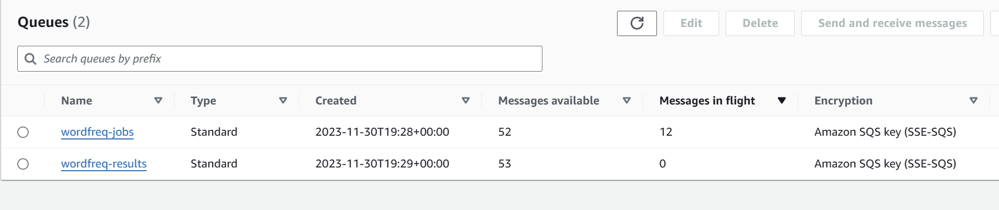
- wordfreq-jobs：这个队列有52条消息可用（Messages available），这意味着有52条消息等待被处理。此外，有12条消息处于飞行状态（Messages in flight），这意味着这些消息已经被某个消费者接收但还没有被删除或处理完成。
- wordfreq-results：这个队列有53条消息可用，没有消息处于飞行状态。
- “message available”指的是队列中等待被消费者接收的消息数量。这些消息尚未被任何消费者接收。
- “message in flight”是指那些已经被消费者接收，但尚未被删除的消息。在消息处理完毕之后，消费者需要从队列中删除这些消息，以防止它们被再次处理。如果消费者在处理消息后没有成功删除消息，该消息会在“可见性超时”期满后再次变为可用状态。

message available一般认为是队列中待处理消息的数量，而message in flight则是已经被消费者接收但还没有被删除或处理完成的消息数量。

可以看到，使用approximateNumberOfMessagesVisible作为指标，
在三分钟内该指标数量下降10左右，说明每分钟可以处理3-4个消息。（此时仅有一个EC2实例）


如上图是CloudWatch创建的对于approximateNumberOfMessagesVisible的监控图，
可以看到大概20mins内一个ec2实例处理了80个消息左右，同样推断出每分钟可以处理3-4个消息。

可以以此为基准，设计自动扩展的规则。
为了为WordFreq应用程序设置自动扩展的阈值，我们需要根据实例处理消息的能力和消息到达的速度来进行计算。这里是一个设计阈值的基本方法：

1. **计算单个实例的处理能力：**
   - 假设平均每条消息处理时间为15秒（在10-20秒之间的平均值）。
     - 可以由上面metric的图看到，每分钟可以处理3-4个消息
   - 因此，每个实例每分钟可以处理的消息数为 60 / 15 = 4。

2. **估算阈值：**
   - 如果队列中的消息数量超过了一个实例在一定时间内（例如5分钟）可以处理的数量，应该扩展新实例。5分钟内一个实例可以处理的消息为 5 * 4 = 20。
   - 因此，如果`ApproximateNumberOfMessagesVisible`超过20，可以考虑扩展一个新实例。
   - 对于缩减规模，如果`ApproximateNumberOfMessagesVisible`持续低于5（考虑到冷却时间和处理波动），可以考虑移除一个实例。

ApproximateNumberOfMessagesVisible表示在SQS队列中当前可见的消息数量，也就是说，这些消息目前等待被处理而还未被任何消费者接收。
这个指标可以用来估算队列中待处理消息的数量，以及是否需要扩展新的工作实例来处理这些消息。


## 4. 创建Auto Scaling Group
1. **创建Auto Scaling Group：**
   - 在 EC2 控制台中，选择“Auto Scaling Groups”。
   - 点击“Create Auto Scaling Group”。
   - 选择刚刚创建的 Launch Template。（使用ami-backup3作为template）
   - 选择no load balancer。
   - additional settings中，选择“Enable group metrics collection”。使得CloudWatch可以收集组内实例的指标。
   - 设置desired capacity为1，min capacity为1，max capacity为2
   - no scaling policies
   - notification选择发送到SNS topic yhb-wordfreq-file-copied

2. **创建Auto Scaling Group的Scaling Policies：**
- 选择创建dynamic scaling policy
- 选择simple scaling
- 选择使用cloudwatch alarm
- 首先需要创建一个policy，此时可以在cloudwatch中创建一个alarm，这个alarm根据这个simple scaling policy找到我的auto scaling group，然后根据这个auto scaling group
- 设置alarm的metric为SQS的ApproximateNumberOfMessagesVisible，设置threshold为20，period为5mins，当大于等于20时，触发alarm
- 将该alarm连接到之前的policy，称为add policy，设定触发alarm则add 1 instance
- 同样方法创建sub policy，当alarm小于等于5时，remove 1 instance

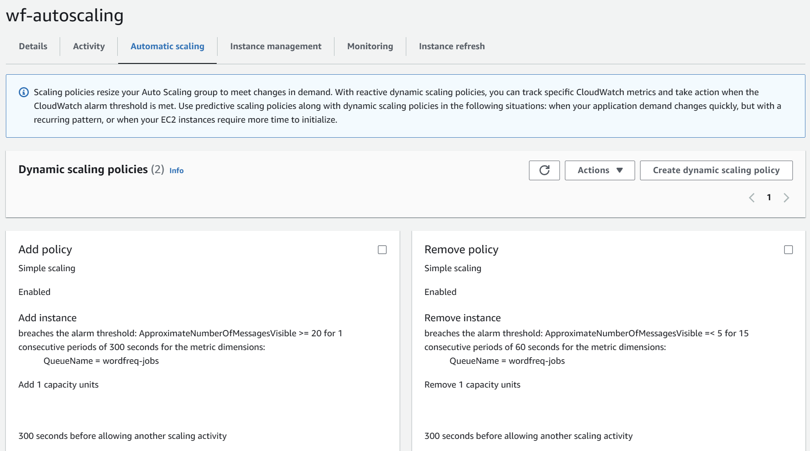

#### 关于Auto Scaling Group中不同type的policy：
- **Target Tracking Scaling Policy**：根据指标的变化，自动调整实例数量，使得指标保持在目标值附近。
- **Simple Scaling Policy**：根据指标的变化，自动调整实例数量，使得指标保持在目标值附近。
- **Step Scaling Policy**：根据指标的变化，自动调整实例数量，使得指标保持在目标值附近。但是，与前两种不同的是，Step Scaling Policy可以根据指标的变化，调整实例数量的多少，而不是只能增加或减少一个实例。

其中Simple 和 Step policy可以根据cloudwatch的指定指标得到的alarm进行调整，而Target policy则是根据指定的target value（仅四五个）进行调整。

#### 关于CloudWatch设置中datapoints to alarm
如果您将CloudWatch警报的“Period”设置为5分钟，并且“Datapoints to Alarm”配置为1 out of 3，这意味着：

Period: 每个数据点代表5分钟内的监控数据。
Evaluation Period: 您的警报将考虑最近的3个数据点（即最近的15分钟）。
Datapoints to Alarm: 在这15分钟的评估周期内，只要有任意一个5分钟的数据点超过了您设定的阈值，警报就会被触发


# Work load testing

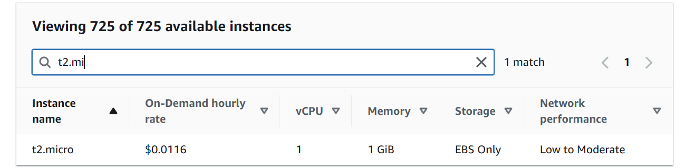

ec2实例运行价格：每小时0.0116美元

复制文件到processing桶
```shell
aws s3 cp s3://yhb-wordfreq-uploading s3://yhb-wordfreq-processing --exclude "*" --include "*.txt" --recursive
```
观察到从launch new instance 到正常running，需要4mins

## EXP1
原初设定：

- **Auto Scaling 组名字**: wf-autoscaling
- **期望容量（Desired Capacity）**: 1
- **最小容量（Minimum Capacity）**: 1
- **最大容量（Maximum Capacity）**: 3

1. **添加实例策略**:
   - 当 `ApproximateNumberOfMessagesVisible` 大于等于 20 消息超过 180 秒时，添加一个实例。
   - 在另一个扩展活动之前有 200 秒的冷却期。

2. **移除实例策略**:
   - 当 `ApproximateNumberOfMessagesVisible` 小于 5 消息持续 300 秒时，移除一个实例。


### 分析与建议：

- **添加实例策略**:
  - 您设置的阈值 20 可能是基于每个实例处理消息的能力和处理时间来决定的。考虑到每个消息的处理时间为 10-20 秒，阈值 20 意味着如果单个实例不能在 180 秒内处理这些消息，就会启动另一个实例。您需要观察这是否导致了过度扩展。

- **移除实例策略**:
  - 阈值 5 消息，连续 5 分钟，这个设置比较保守，意味着只有在消息量非常低的情况下才会减少实例。如果实例的处理速度非常快，可能会导致实例在不必要的时候运行，增加成本。

- **冷却时间**:
  - 200 秒的冷却时间看似合理，但这也取决于您的应用程序启动新实例并开始处理消息所需的时间。如果启动和初始化时间非常快，冷却时间可能稍微调短；如果较慢，则冷却时间可能需要加长。
  - 观测到auto scaling group自动扩展启动一个实例的start time和end time，发现start time和end time的差值大概为40s，可以合理降低冷却时间。比如将冷却时间设置为100s。
- **CloudWatch 监控**:
  - 您应该监控 CloudWatch 中的 `ApproximateNumberOfMessagesVisible` 指标，以验证实际的消息处理速度和队列深度是否符合预期，并根据实际表现调整策略阈值。


```
aws s3 cp s3://yhb-wordfreq-uploading s3://yhb-wordfreq-processing --exclude "*" --include "*.txt" --recursive
```
这个代码表示将yhb-wordfreq-uploading中的所有txt文件复制到yhb-wordfreq-processing中，

从启动到实例通过检查正常运行大概需要4mins，这个时间可以作为冷却时间的参考。


命令行查看ec2 instance日志describe：
```shell
aws ec2 describe-instances --instance-ids i-05dff08ce01c38f3e --region us-east-1
```

## EXP2
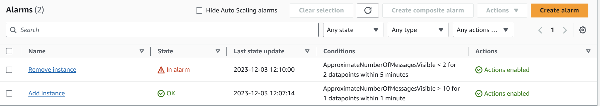

修改alarm策略如下：
- add instance：>10 period 1 min, for 1 datapoints within 1 mins
- remove instance：<2 period 1 min, for 2 datapoints within 5 mins

总时间约12min
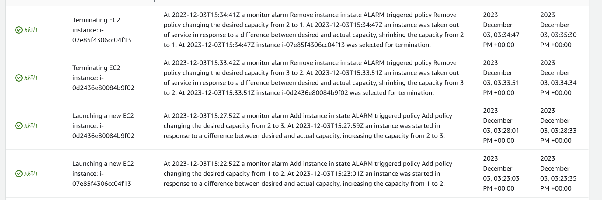

origin：12min\
auto1：start15：23：35--end15：35：30\
auto2：start15：28：33--end15：34：34

cost：0.00599

## EXP3
warmup time：当EC2实例处于预热期间，AWS Auto Scaling 确保这个实例不会接收到来自 SQS 队列的任务。这个预热期是为了给新启动的实例提供足够的时间来完成其启动过程和应用程序的初始化，而不会对正在处理的任务造成影响。
在预热期结束后，实例将会被认为是准备就绪的，并开始接收分配的任务。这是为了确保在实例完全准备好之前，不会被过早地引入流量，这有助于避免潜在的启动失败或性能问题。在 Auto Scaling 组的配置中正确设置预热时间对于维护应用程序性能和可靠性至关重要。

在本此实验中，设定warmup time为180s

**简单缩放策略（Simple Scaling Policy）**
- 优点:简单易懂：只需设置一个单一的阈值，当触发时自动缩放动作就会执行。
容易设置：因为它不涉及复杂的参数，因此对于新用户来说更加友好。
- 缺点:反应时间固定：_**在执行缩放活动之间有一个冷却期，这个冷却期是固定的，这可能会导致对负载变化的响应不够灵活。
不适合复杂的缩放需求**_：如果系统的负载变化非常快速或者不是线性的，简单缩放策略可能无法有效地响应这些变化。

**步骤缩放策略（Step Scaling Policy）**
- 优点:更高的灵活性：可以根据不同的负载阈值来定义多个步骤，每个步骤可以配置不同数量的实例增加或减少。
适应性强：可以更精细地控制缩放动作，根据实际的负载需求进行响应，特别是在负载变化较大时。

Step Add
- Add 1 capacity units when 10 <= ApproximateNumberOfMessagesVisible < 30
- Add 1 capacity units when 30 <= ApproximateNumberOfMessagesVisible < +infinity

Step Remove
- Remove 1 capacity units when 9 >= ApproximateNumberOfMessagesVisible > 5
- Remove 1 capacity units when 5 >= ApproximateNumberOfMessagesVisible > -infinity

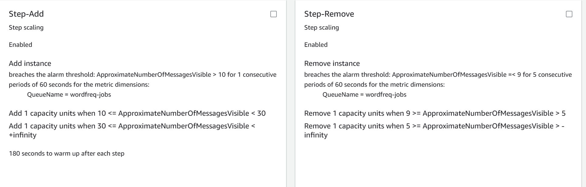

Alarms：
- ApproximateNumberOfMessagesVisible <= 9 for 2 datapoints within 5 minutes
- ApproximateNumberOfMessagesVisible >= 10 for 1 datapoints within 1 minutes

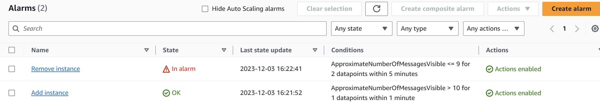

results：

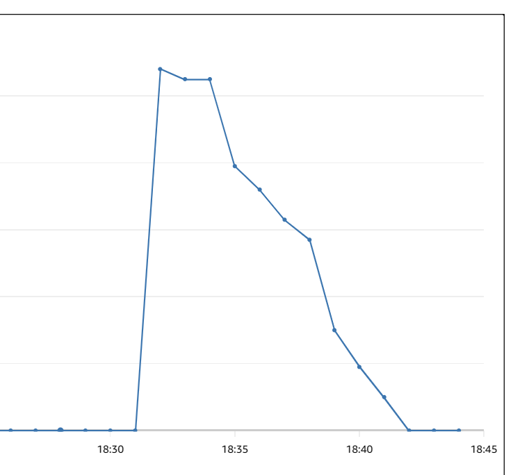

总共处理时间：约11min\
自动扩展行为时间：有180s预热时间
auto1：start18：33：14--end18：46：15\
auto2：start18：37：16--end18：45：19

cost:0.00657

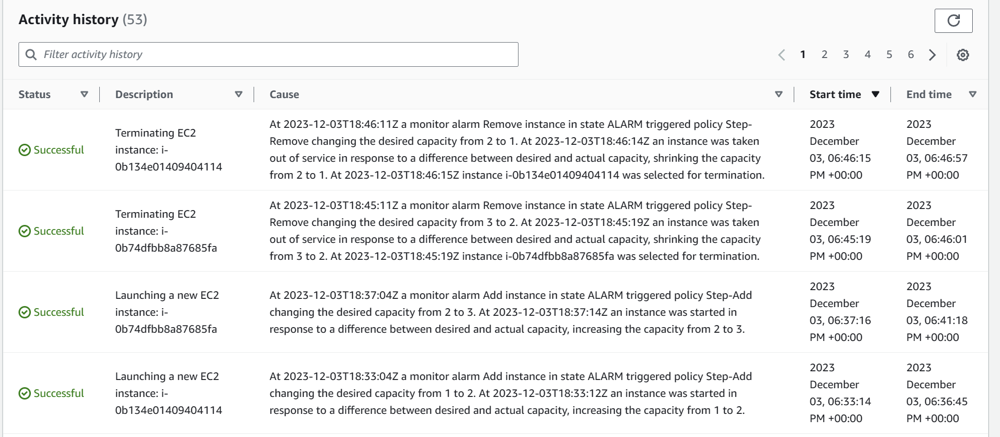

## EXP7--great one
300 files

auto1:05:44:25--06:00:29，964s
auto2:05:44:25--05:59:34，909s
auto3:05:44:25--05:59:34，909s
auto4:05:48:29--05:59:33, 664s
auto5: 14min，840s
总共时间：4286s
cost:$0.01392


## EXP4
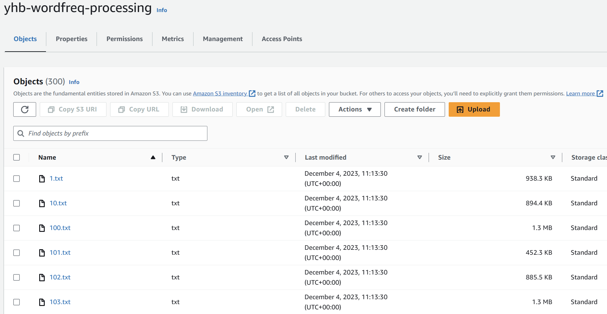

上传了约300个txt文件用于此次测试。

实例类型：all t2.micro

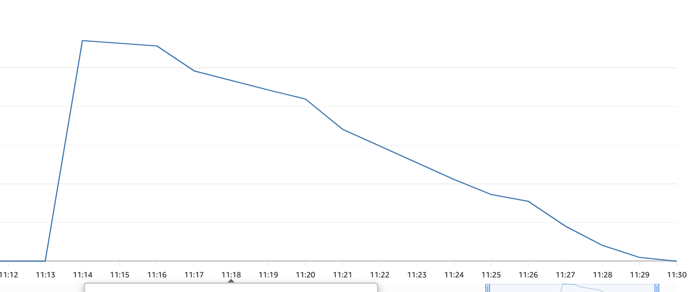

Desired capacity:1, Min capacity:1, Max capacity:5. All instances are t2.micro

Adjust the alarms as following:
- add instance:ApproximateNumberOfMessagesVisible >= 20 for 1 datapoints within 1 minutes
- remove instance: ApproximateNumberOfMessagesVisible <= 15 for 2 datapoints within 3 minutes

Adjust the scaling policies as following:
- Step Add
  - Add 2 capacity units when 20 <= ApproximateNumberOfMessagesVisible < 50
  - Add 2 capacity units when 50 <= ApproximateNumberOfMessagesVisible < +infinity
- Step Remove
  - Remove 2 capacity units when 15 >= ApproximateNumberOfMessagesVisible > 10
  - Remove 2 capacity units when 10 >= ApproximateNumberOfMessagesVisible > -infinity

Default cooldown: 200s; Default warmup: 180s

完成时间：11：39-11：56，大概17min
auto1：11:42:06--11:58:18
auto2：11:42:06--11:58:18

auto3：11:45:57--11:57:23
auto4：11:45:57--11:57:23
auto5：17min

total cost:0.01450


## EXP5
创建新auto scaling group，使用t2.small实例，其他设置与EXP4相同
完成时间大概15min
auto1：
auto2：
auto3：
auto4：
auto5：
总共时间： 
cost：


Default cooldown: 200s; Default warmup: 180s

## EXP6
使用与exp5同样的扩展策略，仅将template的实例类型改为t2.medium
完成时间大概9min
auto1：06:47:39--06:56:23，524s
auto2：06:47:39--06:56:23，524s
auto3：06:47:39--06:56:23，524s
auto4：06:51:22--06:58:32，430s
auto5：9min，540s
总共时间：2542s
cost:$0.03325


## EXP7
使用approximatenumberofmessagenotvisible作为缩减metric

Add policy:
- Add 3 capacity units when 60 <= ApproximateNumberOfMessagesVisible < 120
- Add 3 capacity units when 120 <= ApproximateNumberOfMessagesVisible < +infinity

Remove policy:
- Remove 4 capacity units when 20 >= ApproximateNumberOfMessagesNotVisible > -infinity

auto1：10:57:31--11:05:55，504s
auto2：10:57:31--11:05:55，504s
auto3：10:57:31--11:05:55，504s
auto4：11min
total：504*3+660=2672s
$0.00870


## tip
如果remove的alarm过于敏感（1 out 3）,此时如果使用small或micro的instasnce，会导致在即将结束时
过于快速缩减，导致实际处理message时间边长。

medium类型则由于处理速度较快，可以使用1out3\
更弱的类型必须调整remove的敏感度，使用2out3尝试。