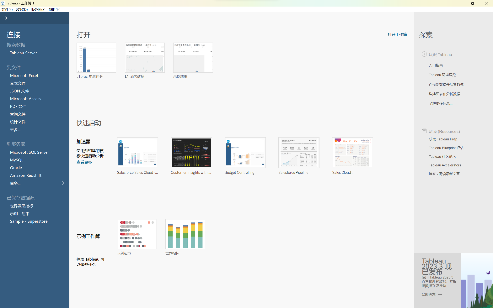
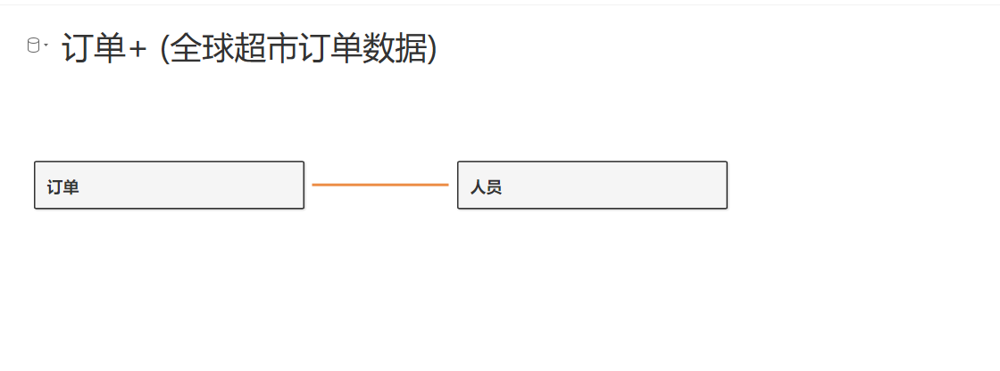

# Tableau Tutorial
Tableau是一款商业智能工具，它提供了可视化分析的功能，可以将数据转换成图表和图形，从而更好地理解数据。它可以连接到各种数据源，包括文本文件、关系数据库、Hadoop、云数据库等，可以对数据进行快速的分析和可视化，可以将数据转换成图表和图形，从而更好地理解数据。它可以连接到各种数据源，包括文本文件、关系数据库、Hadoop、云数据库等，可以对数据进行快速的分析和可视化。

本教程为Tableau基础入门教程，主要介绍了Tableau的安装、界面、数据源、数据分析、图表、工作簿、仪表板、故事等内容。

# 1. 基本结构
## 1.1 Tableau Desktop
Tableau Desktop是Tableau的核心产品，它是一款商业智能工具，可以将数据转换成图表和图形，从而更好地理解数据。它可以连接到各种数据源，包括文本文件、关系数据库、Hadoop、云数据库等，可以对数据进行快速的分析和可视化。

### 工作簿（Workbook）
- **定义**：Tableau中的工作簿类似于Excel中的工作簿，它是存储一系列相关数据视图、仪表盘和故事的文件。
- **用途**：您可以在一个工作簿中创建多个工作表（单个视图），然后将这些工作表组合到仪表盘或故事中。

在Tableau中，工作表（Worksheet）、仪表板（Dashboard）和故事（Story）是三种不同的视图和布局方式，它们各自具有独特的功能和用途。了解这三者的区别对于有效地使用Tableau至关重要。

### 工作表（Worksheet）
- **定义**：工作表是Tableau中的基本构建块，您在工作表中创建各种图表和可视化。每个工作表通常包含一种类型的图表（如条形图、线图、散点图等）。
- **用途**：工作表用于详细分析数据，探索特定的数据点或趋势。它是执行数据分析的地方，您可以在此处使用不同的数据视图来回答特定的数据问题。
- 数据类型大体分为`度量`和`维度`,`日期`，其中`度量`为定量数据，`维度`为定性数据。选择合适的数据放入`行`和`列`中，即可绘制出相应的图表。`日期`一般为时间序列数据。

### 仪表板（Dashboard）
- **定义**：仪表板是一个容器，可以在其中组合多个工作表和其他组件（如文本、图像、网页等）。
- **用途**：仪表板用于汇总和展示来自多个工作表的信息，提供一个综合的、交互式的视图。它允许用户通过一个统一的界面查看多种数据视图，进行比较和综合分析。

### 故事（Story）
- **定义**：故事是一系列按顺序排列的幻灯片，每个幻灯片可以包含工作表、仪表板或纯文本页。
- **用途**：故事用于讲述一个连贯的数据故事，引导观众通过一系列的数据视图和解释理解数据背后的洞察。它像一个叙述性的演示文稿，用于展示数据分析的过程或结果。

总的来说，工作表专注于单一类型的数据可视化，仪表板将多个工作表和组件结合在一起，提供一个交互式的综合视图，而故事则用于通过一系列有序的幻灯片展示数据的洞察和故事线。在Tableau中灵活运用这三种工具，可以有效地表达和展示数据洞察。
### Tableau的基本使用步骤
1. **连接数据源**：启动Tableau后，首先需要连接到一个数据源，比如Excel文件、数据库或Web数据。

2. **创建视图（工作表）**：连接数据后，您会进入工作表界面。在这里，您可以通过拖放字段到行、列、颜色、大小等区域来创建不同类型的图表。

3. **构建仪表盘**：一旦在工作表中创建了一些视图，就可以在仪表盘中将它们组合起来。这可以通过拖放工作表到仪表盘区域来完成。

4. **创建故事**：创建故事时，您可以将工作表或仪表盘添加到故事中，并添加文本描述来引导观众理解您的数据故事。

5. **分享和发布**：完成您的工作簿后，您可以将其保存、分享或发布到Tableau Server或Tableau Public，以便他人查看和交互。

6. **导出图像**：您可以将工作表或仪表盘导出为图像，然后将其插入到Word文档或PowerPoint演示文稿中。其中可以选择添加`说明`, 用于描述图像的内容或进行分析。

## 1.2 Appearance
Tableau Desktop的界面如下图所示：

- 连接: 用于连接到数据源，可以连接到各种数据源，包括文本文件、关系数据库、Hadoop、云数据库等。
- 工作表: 用于创建图表和图形，可以将数据转换成图表和图形，从而更好地理解数据。
- 仪表板: 用于创建仪表板，可以将多个工作表组合到一个仪表板中，从而更好地展示数据。
- 故事: 用于创建故事，可以将多个仪表板组合到一个故事中，从而更好地讲述数据背后的故事。

## 1.3 Data Preparation
使用Tableau可以进行简单的数据预处理，包括数据清洗、数据整合、数据转换等。在Tableau中，数据预处理主要通过计算字段、参数、集合、分组、合并等功能来实现。

### 计算字段（Calculated Field）
- **定义**：计算字段是一种新的字段，它是通过对现有字段进行计算而创建的。计算字段可以用于创建新的维度或度量。
- **用途**：计算字段可以用于创建新的维度或度量，从而实现数据预处理的功能。
- **创建**：在Tableau中，可以通过单击`分析`->`创建计算字段`来创建计算字段。在弹出的对话框中，可以输入计算字段的名称和计算公式，然后单击`确定`即可创建计算字段。

### 分组（Group）
- **定义**：分组是一组维度成员的集合，它可以用于存储一组维度成员，并且可以在工作簿中的多个视图中使用。
- **用途**：分组可以用于存储一组维度成员，并且可以在工作簿中的多个视图中使用，从而实现数据预处理的功能。
- **创建**：在Tableau中，可以通过单击`分析`->`创建分组`来创建分组。在弹出的对话框中，可以输入分组的名称、维度、成员等信息，然后单击`确定`即可创建分组。

### 合并（Join）
- **定义**：合并是将两个或多个数据源中的数据合并到一个数据源中的过程。
- **用途**：合并可以将两个或多个数据源中的数据合并到一个数据源中，从而实现数据预处理的功能。
- **创建**：在Tableau中，可以通过单击`数据`->`合并数据`来创建合并。在弹出的对话框中，可以选择要合并的数据源，然后单击`确定`即可创建合并。

### 拆分（Split）
- **定义**：拆分是将一个字段中的数据拆分成多个字段的过程。
- **用途**：拆分可以将一个字段中的数据拆分成多个字段，从而实现数据预处理的功能。
- **创建**：在Tableau中，可以通过单击`数据`->`拆分字段`来创建拆分。在弹出的对话框中，可以选择要拆分的字段，然后单击`确定`即可创建拆分。
- **自定义**：在Tableau中，可以通过单击`数据`->`自定义拆分`来创建自定义拆分。可以使用正则表达式来定义拆分规则，然后单击`确定`即可创建自定义拆分。

### 缺失值处理
可以对缺失值进行“排除”、“显示”、“替换”等操作。其中，“排除”是指将缺失值排除在外，不参与计算；“显示”是指将缺失值显示为“NULL”；“替换”是指将缺失值替换为其他值。

# 2. Basic Plot
## 2.1 Bar Chart
绘制条形图，首先需要确定横坐标和纵坐标的字段，然后将字段拖拽到对应的位置。注意：横坐标应当将相应数据拖动到
`Columns`，纵坐标应当将相应数据拖动到`Rows`。

上图使用`产地`作为横坐标，使用`计数`作为纵坐标，绘制了一个条形图。其中产地属于定类数据，计数属于定量数据（位于`度量名称`中）。

在`标记`中，可以修改条形图的颜色、大小、形状等属性。将不同字段拖到`颜色`、`大小`、`形状`中，可以根据不同的字段对条形图进行分类。或用于在条形图上方显示数据标签。

## 2.2 Histogram
绘制直方图，首先需要将列字段建立数据桶（Bins），然后用建立条形图的方式绘制直方图。

注意，Tableau中直方图横坐标为该Bin的左区间端点值。

## 2.3 Line Chart
折线图的绘制很简单，只需要将横坐标和纵坐标的字段拖动到对应的位置即可。

## 2.4 Pie Chart
饼图有两种方式，首先可以正常将横纵坐标的字段拖入相应位置，然后用右边栏`智能推荐`中的`饼图`进行绘制。

或者直接将分类字段拖入`标记`中的`颜色`，然后将度量字段拖入`角度`，即可绘制饼图。

设置百分比：添加标签后，对该标签右键选择`快速表计算`->`百分比`即可。

### Circle Chart
环形图无法直接绘制，需要绘制两个饼图，然后调整其中一个大小使其变小，并设置其颜色与背景色一致。
然后需要将两者设置为同轴即可合并为一个环形图。具体步骤如下：
- 绘制一个饼图
- 将计数值添加到`行`,并按住`Ctrl`得到另一个相同的计数值在`行`中（即复制）

- 对`行`中的两个计数值字段右键：快速表计算->排序，此时会得到上下两个相同饼图

- 

- 调整其中一个饼图为大图，用于外环，另一个为内环
- 右键对内环的字段（在`行`中）设置`双轴`，此时会得到一个饼图，大图覆盖了小图
- 对小图：删除标记->颜色，此时会得到一个环形图，内环为灰色，只需要将其颜色设置为白色即可

## 2.5 基本表
### 基本表的使用
基本表可以用于展示数据，也可以用于筛选数据。在基本表中，可以对数据进行排序、筛选、计算等操作。

如下图所示：

首先确认行字段，可以看见每行对应的数据为“Abc”，表示为字符串类型。

然后如果需要看每个地区酒店数量，可以将字段`酒店计数`拖入Abc对应的位置。同样，如果需要每个地区对应的评分或价格等数据，也可以直接拖入。
并且可以选择每个数据的度量标准：如选择求和/平均值/中位数等。

### 凸显表
凸显表可以用于展示数据，也可以用于筛选数据。在凸显表中，会使用颜色来凸显某些数据，从而更好地展示数据。

可以直接使用智能显示中的凸显表，也可以使用基本表，然后在`标记`中选择`颜色`，选择需要凸显的字段即可。同时可以调整不同图形进行凸显

### 二值凸显表
可以通过`标记`中的`颜色`来设置二值凸显表，其中颜色的设置如下：
主要设置色阶为2，并设置中心。

通过设置中心，当数量大于中心时，颜色为红色，当数量小于中心时，颜色为蓝色。

## 2.6 树形图
确定列和行字段后（一般列为类型，行为计数），使用智能显示中树形图即可。

同时，可以对颜色词条添加字段，用于对树形图进行分类。

对于右下角的过于小的色块，可以通过筛选器进行剔除。

## 2.7 气泡图和词云
### 气泡图
使用智能显示中的气泡图即可，其中可以设置气泡的大小和颜色。

### 动态气泡图

### 步骤 1: 创建基本气泡图
1. 选择您想在气泡图中展示的维度（如类别）和度量值（如销售额、利润等）。
2. 将一个维度字段拖到“行”区域，另一个维度字段拖到“列”区域。
3. 将一个或多个度量字段拖到“大小”区域，以定义气泡的大小。
4. 可以将度量或维度字段拖到“颜色”区域，以给气泡上色。

### 步骤 2: 添加时间动态性
1. 将时间字段（如日期或年份）拖到“页”（Pages）区域。这会添加一个时间轴控制器到您的视图。
2. 在“页”控制器中，您可以播放时间序列，观察气泡如何随时间变化。

使用`页`添加时间字段，即可实现动态气泡图。

在右边栏可以选择是否显示轨迹，以及轨迹的形状等。

### 词云
首先制作气泡图，然后在`标记`中添加颜色字段，然后选择`文本`，即可实现词云。

## 2.8 标靶图
标靶图是一种特殊的条形图，可以用于展示目标值和实际值的对比。

标靶图的制作可以通过智能显示（需要两个度量字段）或手动对条形图添加目标值（`添加参考线`）来实现。

通过设置目标值计算方式：字段(值)-->计算方式 来添加目标值。

首先，度量字段有两个，一般一个为实际值，一个为目标值，然后直接使用智能显示即可得到标靶图。

若手动实现，则需要添加实际值到行字段，然后添加目标值到标记-->详细信息

然后添加参考线，选择目标值，并应用区域为每个单元格，即可得到标靶图。

### 关于参考线
在`添加参考线`的设置中，可以添加线，区域，分布和盒须图等参考线。

## 2.9 甘特图
甘特图指的是一种时间管理图表，它可以用于展示项目的进度和时间安排。

上图中，红色表示延迟交货，蓝色为提前交货，且色块长度为延迟/提前天数。

具体步骤如下：
- 对列字段填入时间字段，并选取为度量值。即绿色框。
- 对行字段填入需要展示的内容。
- 通过实际值和目标值进行计算：实际值-目标值，即可得到延迟/提前天数。对相应字段进行创建计算字段即可。
- 将计算字段加入标记中的`大小`,`颜色`，即可得到甘特图。

注意，对于列字段中添加的时间字段，需要选择下面部分，即度量值。若选取上面部分则为维度值，无法进行计算。

## 2.10 瀑布图
瀑布图是一种特殊的条形图，可以用于展示数据的累计值和变化情况。

首先，绘制条形图，并作如下设置：
- 进行排序，使得数据按照从左往右升序。
- 注意：行字段必须进行汇总操作：选择行字段，右键，选择累计汇总

- 得到如图显示，其中每一列都是累加所得数据，第一列为负值表示该产品利润为负，即亏损，其他列均盈利但是当总盈利大于亏损后条形图变为正向。

- 注意标签只是对应列产品的总利润，而图的纵轴为累计总利润。
- 在`标记`中选择`甘特条形图`，得到如下图所示：

- 瀑布图为将改图的每列的线段作为起始点，然后向负方向作图（像瀑布一样向下流）。如果利润为正，则向下流，如果利润为负，则向上流。
- 因此需要将利润字段取相反数，并添加到`标记`中的`大小`，即可得到瀑布图。
- 可以将`利润`字段添加到`颜色`中，并设置为2色阶，当总利润为负时，颜色为红色，当总利润为正时，颜色为蓝色。
- 在菜单栏选择`分析`->`合计`->`显示行总和`，即可显示总利润。

## 地图
在Tableau中，地图是展示地理数据的重要工具。根据展示数据的方式和视觉效果的不同，Tableau提供了几种不同类型的地图，包括符号地图、填充地图、混合地图和多维地图。了解这些地图的区别有助于您根据分析需求选择最合适的地图类型。

### 1. 符号地图（Symbol Map）
- **特点**：在符号地图上，数据点以符号（如圆圈、方块）的形式展示在地图上的具体位置。
- **用途**：符号地图适用于展示特定地理位置上的度量值，例如显示不同城市的销售额。符号的大小或颜色可以根据相关度量值变化。

### 2. 填充地图（Filled Map）
- **特点**：填充地图使用颜色来填充地图上的区域（如国家、省份、市区），颜色的深浅表示不同的度量值。
- **用途**：填充地图适用于展示区域分布的数据，如显示不同国家的人口密度或某项指标的地区分布情况。

### 3. 混合地图（Heat Map）
- **特点**：混合地图结合了符号地图和填充地图的特点，可以在符号地图的基础上添加颜色填充。
- **用途**：混合地图适用于同时展示特定位置的数据点和区域分布的情况，例如，在显示城市销售数据的同时展示各州的总销售额。

### 4. 多维地图（Density Map）
- **特点**：多维地图（或称密度地图）通过颜色的密度变化来展示数据点的集中程度。
- **用途**：多维地图适合于展示数据点的集聚情况，如显示某个区域内事件发生的密度或频率。

### 总结
- **符号地图**：最适合展示具体位置上的度量数据。
- **填充地图**：适合展示按区域划分的数据。
- **混合地图**：结合了符号和填充地图的特点，适合同时显示位置和区域数据。
- **多维地图**：适合展示数据点的集聚程度，强调区域内的密度分布。

选择哪种地图取决于您想要表达的数据类型和分析目标。每种地图都有其独特的展示方式和适用场景，恰当地使用可以有效增强数据可视化的表现力和解释性。

## 2.11 符号地图
符号地图是一种特殊的地图，可以用于展示地理位置和数据的关系。

如果需要绘制地图，需要对相应的字段修改数据类型，若为字符串类型需要改为`地理角色`.

将所需度量数据拖入`大小`，则会得到符号地图。

Tableau可能无法正确识别一些地名，因此需要手动操作：

其中编辑位置即手动编辑未识别地区的所属位置，筛选数据即排除未识别地区的数据。

## 2.12 填充地图
若将所需度量数据拖入`颜色`，则会得到填充地图。

## 2.13 多维地图
多维地图制作首先需要制作符号/填充地图，然后在行/列中添加其他维度字段即可

## 2.14 混合地图
混合地图即结合多种不同地图。主要方法为先做一种地图，然后通过对行/列中`经度`和`纬度`的复制，得到左右/上下两个地图，
将两个地图使用`双轴`进行合并，然后对其中一个地图修改为另一种类型即可。

如上图所示为两个完全一致的填充地图，现在使用双轴合并，然后将其中一个改为符号地图。
并在`标记`中添加其他维度字段，即可得到混合地图。

如上图所示为最终效果，其中第一层通过填充地图颜色深浅表示当期值，第二曾通过符号地图圆形大小表示同期值，
第三层通过符号地图中圆形颜色表示累计同期值。

## 2.15 多边形地图
多边形地图（Polygon Map）在Tableau中是一种特殊的地图类型，用于显示自定义的地理区域。它不是基于标准的地理单元（如国家、省份、城市等）来绘制，而是利用一组特定的经纬度点来定义区域的边界，并根据这些点绘制出多边形区域。这种地图非常适合展示不规则或非标准的地理区域。

### 特点
1. **自定义区域**：多边形地图允许用户根据一组特定的经纬度坐标绘制自定义的地理区域，这些区域可以是非标准的地理单元。

2. **灵活性**：用户可以根据需要绘制任何形状的区域，这在标准地图类型中是不可能的。

3. **详细展示**：多边形地图适用于展示详细的地理数据，比如一块特定的土地、商业区域、甚至室内布局图。

您需要拥有表示多边形每个顶点的经纬度坐标数据，以及这些点如何连接（即点ID或连接顺序）来形成特定区域的信息。
一般称这样的数据为“多边形数据”。如下图所示：

其中，`经度`和`纬度`表示多边形每个顶点的经纬度坐标，`点ID`表示每个顶点的ID。

绘制多边形地图时，将点ID这样的路径信息拖入`路径`，会按照路径信息勾选处相应轮廓，然后填充颜色即可。

注意：上图中数据集的经纬度为数值型，需要先在数据源处将其转换为地理角色--经度和纬度。

多边形地图绘制步骤：
- 将经纬度拖入`行`和`列`，会得到一个普通地图
- 将`标记`中选择为`多边形`，并将`点ID`拖入`路径`，将需要显示的地理位置信息拖入`颜色`，即可得到多边形地图。

## 设置地理信息
### 1. 自定义地理编码导入
通过地图-->地理编码-->导入自定义地理编码，选择相应的csv文件（有特定格式），即可导入自定义地理编码。
自定义地理编码主要用于添加Tableau中没有的地理信息，如次级行政区等。

注意：通过自定义地理编码导入后，会得到新的地理角色，但是只可用于绘制符号地图。

# 3. Advanced Practice
## 3.1 数据集合并
### 1. Relationship & Join
在Tableau中，关于数据集的“关联（Relationship）”和“连接（Join）”是两种不同的数据组合方法，它们有着不同的特点和适用场景。

### 连接（Join）
- **定义**：连接是一种数据库操作，用于将两个或多个表的行组合在一起，基于共同的字段或键。
- **类型**：常见的连接类型包括内连接（Inner Join）、左连接（Left Join）、右连接（Right Join）和全外连接（Full Outer Join）。
- **行为**：连接会在数据加载到Tableau之前在数据库级别发生，它实际上创建了一个新的表，其中包含了所有指定的字段。
- **用途**：当您需要合并来自不同表的数据，并且这些表中有共同的字段时，使用连接。
- 连接需要定义连接的方式，即连接类型，常见的连接类型包括内连接（Inner Join）、左连接（Left Join）、右连接（Right Join）和全外连接（Full Outer Join）。一般可以有韦恩图来表示不同连接类型的区别。

### 关联（Relationship）
- **定义**：在Tableau 2020.2及以后的版本中引入了“关联”，它允许用户定义不同数据表之间的关系，而不是直接连接它们。
- **行为**：关联在数据模型级别上定义表之间的逻辑连接，而不是物理合并行。Tableau会根据需要动态地在视图级别处理数据，这样可以保留表的原始粒度和结构。
- **用途**：当您有来自不同表的数据，这些数据表在逻辑上相关但结构上不同，或者您希望保留不同粒度的数据时，使用关联。
- 关联并不使用韦恩图，只是简单的将两个表进行关联，然后在视图中进行数据处理。

### 区别
- **数据处理级别**：连接是在数据预处理阶段发生的，而关联是在视图构建时动态发生的。
- **数据结构**：连接会创建一个新的扁平化数据表，关联则保留原有的表结构。
- **性能和灵活性**：关联提供了更高的灵活性，可以更好地处理不同粒度的数据，而连接可能会因为合并大量数据而影响性能。

在Tableau中选择使用关联（Relationship）或连接（Join）主要取决于数据集的结构、分析需求以及对查询性能的考虑。以下是一些具体的使用场景示例，以帮助您理解何时该使用关联或连接。

### 使用连接（Join）的场景
1. **数据粒度一致**：当两个或多个表的数据粒度相同或非常接近时，连接是一个好选择。例如，您有两个表：一个包含员工的销售记录，另一个包含员工的详细信息，两个表都是以员工为基础记录的。

2. **需要合并详细数据**：如果您的分析需要从不同的表中合并详细数据，例如，将客户的订单数据和客户的个人信息数据合并在一起，以便进行详细的客户分析。

3. **数据量相对较小**：当处理的数据量不是特别大，连接操作不会对性能产生显著影响时。

### 使用关联（Relationship）的场景
1. **数据粒度不同**：当您的数据表具有不同的粒度时，使用关联更合适。例如，一个表是每日销售数据，另一个表是每月的营销支出数据。这两个表的数据粒度不同，直接连接可能会导致数据扭曲。

2. **需要保持表的独立性**：当您希望保持原始表的结构和独立性时，关联是一个好选择。通过关联，Tableau可以根据视图中的需求动态汇总和计算数据，而不是在一开始就物理地合并数据。

3. **处理大型数据集**：如果您正在处理大型数据集，关联可以提高性能，因为Tableau会智能地根据需要加载和计算数据，而不是一开始就加载整个合并的数据集。

4. **灵活性需求高**：当您需要在多个不同的视图中以不同的方式分析相同的数据集时，关联提供了更高的灵活性。

## 3.2 仪表板 Dashboard
仪表板用于汇总和展示来自多个工作表的信息，提供一个综合的、交互式的视图。它允许用户通过一个统一的界面查看多种数据视图，进行比较和综合分析。

如上图所示为一个仪表板，首先需要使用工作表绘制出各种图表，然后将这些图表组合到仪表板中，从而实现数据的汇总和展示。通过仪表板左侧栏进行布局等设置。
